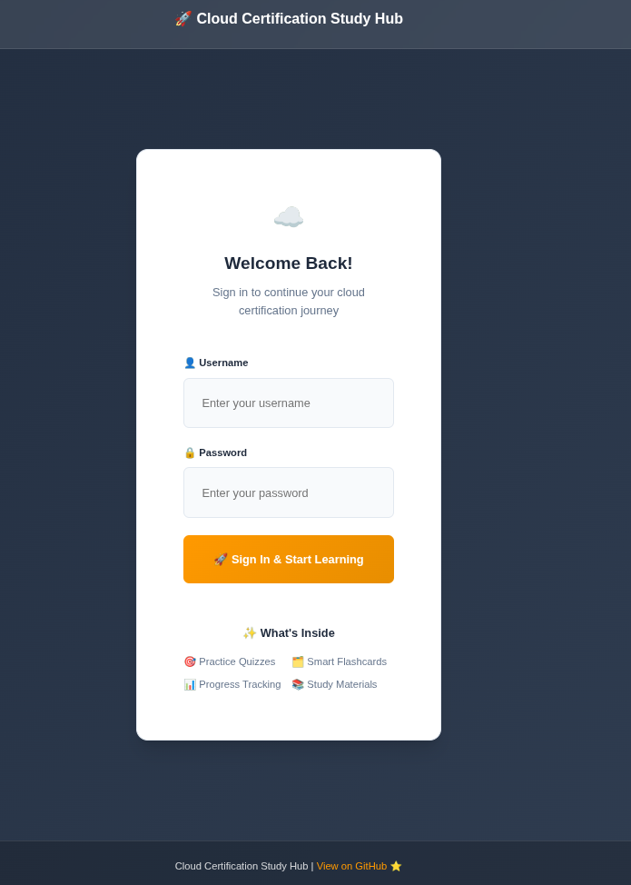
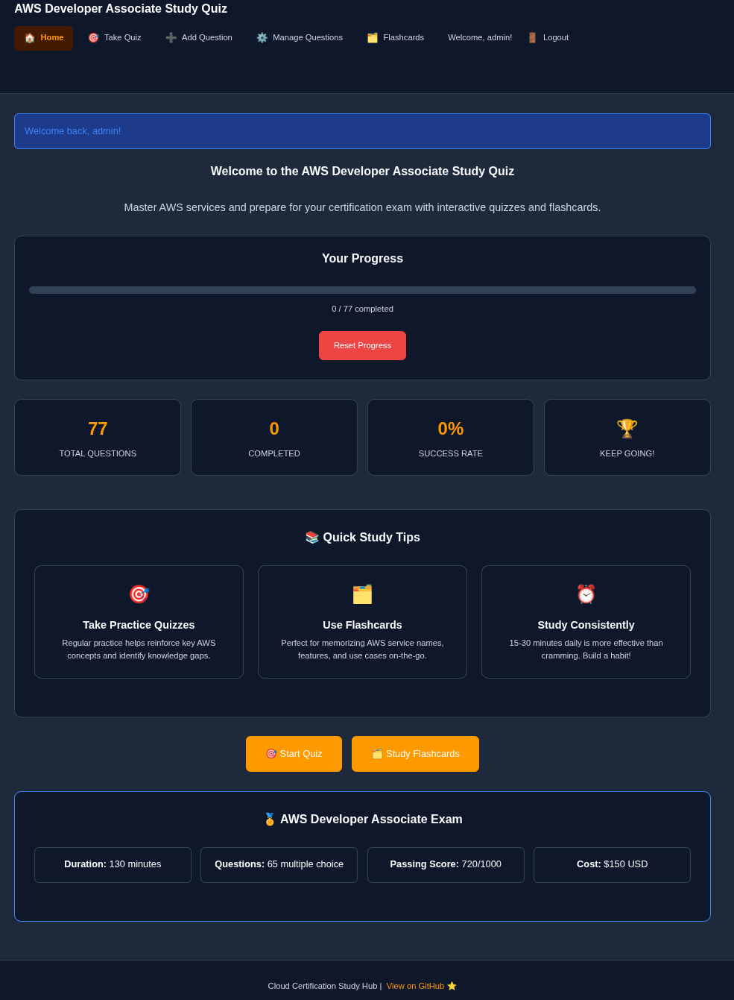
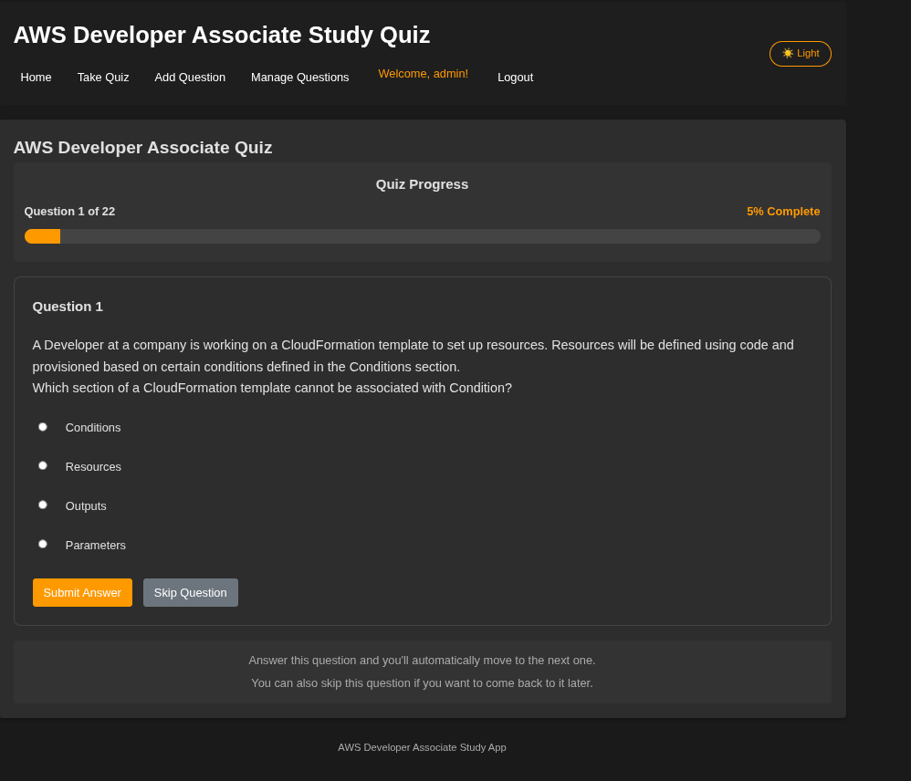
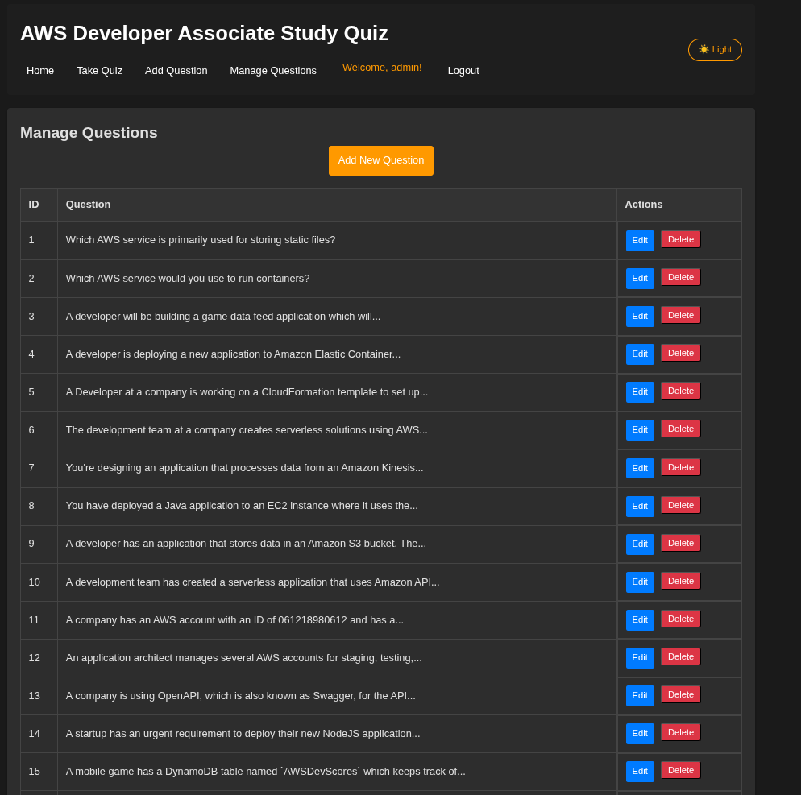

# AWS Developer Associate Study Quiz

A modern, containerized web application for studying AWS Developer Associate exam questions built with Python and Flask. This application provides a focused, one-question-at-a-time quiz experience with user authentication and progress tracking.

## ✨ Key Features

- 🔐 **User Authentication**: Secure login system with predefined user accounts
- 📝 **One Question Per Page**: Focused quiz experience that shows one question at a time
- 🎲 **Randomized Questions**: Questions are shuffled for each quiz session
- 📊 **Progress Tracking**: Server-side progress tracking per user account
- 🌙 **Dark/Light Theme**: Toggle between themes with preference saving
- ✍️ **Markdown Support**: Rich text formatting for questions and explanations
- 🎯 **Quiz Completion**: Detailed results and performance feedback
- ⚙️ **Question Management**: Add, edit, and delete questions through web interface
- 📱 **Mobile Responsive**: Works seamlessly on desktop and mobile devices
- 🐳 **Containerized**: Easy deployment with Docker

## 📸 Demo

### Login Interface
Clean and simple authentication with predefined user accounts:



### Home Dashboard
Welcome page with progress tracking and quiz navigation:



### Quiz Experience
Focused single-question interface with progress indicator:



### Question Management
Admin interface for managing the question database:



## Table of Contents

1. [Prerequisites](#prerequisites)
2. [Quick Start](#quick-start)
3. [Manual Setup](#manual-setup)
4. [User Accounts](#user-accounts)
5. [Features](#features)
6. [Application Structure](#application-structure)
7. [Customization](#customization)
8. [Troubleshooting](#troubleshooting)

## Prerequisites

- [Docker](https://docs.docker.com/get-docker/)
- [Docker Compose](https://docs.docker.com/compose/install/) (usually included with Docker Desktop)

## Quick Start

The easiest way to get started is by using the provided deployment script:

```bash
# Make the script executable
chmod +x deploy.sh

# Run the deployment script
./deploy.sh
```

Once deployed:
1. Access the application at: [http://localhost:5019](http://localhost:5019)
2. Login with one of the predefined user accounts (see [User Accounts](#user-accounts))
3. Start taking the quiz!

## Manual Setup

If you prefer to set up manually or need to customize the installation:

1. **Clone or download the project files**

2. **Build and start with Docker Compose**:
   ```bash
   docker-compose up -d
   ```

3. **Access the application** at [http://localhost:5019](http://localhost:5019)

4. **View logs (if needed)**:
   ```bash
   docker-compose logs -f
   ```

5. **Stop the application**:
   ```bash
   docker-compose down
   ```

## User Accounts

The application comes with predefined user accounts stored in `users.json`. Default accounts include:

- **admin** / admin123
- **student1** / password1  
- **student2** / password2
- **instructor** / teach123
- **demo** / demo

You can modify these accounts by editing the `users.json` file before deployment.

## Features

### 🎯 Quiz Experience
- **Single Question Focus**: One question per page for better concentration
- **Randomized Order**: Questions are shuffled for each quiz session
- **Progress Indicator**: Shows current question number and completion percentage
- **Skip Questions**: Option to skip questions and return later
- **Completion Summary**: Detailed results with score and performance feedback

### 👤 User Management
- **Secure Authentication**: Login required to access quiz features
- **Individual Progress**: Each user's progress is tracked separately
- **Session Management**: Maintains quiz state during active sessions

### 🎨 User Interface
- **Dark/Light Theme**: Toggle between themes with automatic preference saving
- **Mobile Responsive**: Optimized for all screen sizes
- **Modern Design**: Clean, professional interface with smooth animations

### 📝 Content Management
- **Markdown Support**: Rich text formatting in questions and explanations
- **Question Management**: Add, edit, and delete questions through web interface
- **Live Preview**: Real-time markdown preview when creating/editing questions

## Application Structure

```
aws-study-app/
├── main.py                    # Flask application code
├── users.json                 # User accounts database
├── progress.json              # User progress tracking
├── questions.json             # Question database
├── requirements.txt           # Python dependencies
├── img/                       # Demo screenshots
│   ├── AWS_Start.png          # Home dashboard
│   ├── Log_In.png             # Login interface
│   ├── Manage_Page.png        # Question management
│   └── Q_Page.png             # Quiz question page
├── static/                    # CSS and static assets
│   └── css/
│       └── style.css          # Application styling with dark theme
├── templates/                 # HTML templates
│   ├── add_question.html      # Add new questions
│   ├── base.html              # Base template with theme toggle
│   ├── edit_question.html     # Edit existing questions
│   ├── index.html             # Home page with progress overview
│   ├── login.html             # User authentication
│   ├── manage_questions.html  # Question management interface
│   ├── quiz.html              # Single question display
│   ├── quiz_complete.html     # Quiz completion summary
│   └── result.html            # Answer feedback and explanation
├── Dockerfile                 # Container definition
├── docker-compose.yml         # Container orchestration
├── deploy.sh                  # Deployment automation script
└── README.md                  # This file
```

## Customization

### Changing the Port

To change the default port (5019), edit the `docker-compose.yml` file:

```yaml
ports:
  - "8080:5019"  # Change 8080 to your desired port
```

### Adding User Accounts

Edit `users.json` before deployment:

```json
{
  "username": "password",
  "newuser": "securepassword"
}
```

### Adding Custom Questions

You can add custom questions either:

1. **Through the web interface**: Login and go to "Add Question" in the navigation
2. **Direct file editing**: Edit the `questions.json` file before deployment

### Styling and Themes

- **CSS Customization**: Edit `static/css/style.css` 
- **Theme Colors**: Modify CSS variables in the `:root` and `[data-theme="dark"]` sections
- **Logo/Branding**: Update header content in `templates/base.html`

## Troubleshooting

### Container Won't Start

Check the logs for errors:

```bash
docker-compose logs
```

Common issues:
- **Port conflicts**: Change the port in `docker-compose.yml`
- **File permissions**: Ensure JSON files are readable/writable
- **Missing dependencies**: Rebuild with `docker-compose up -d --build`

### Authentication Issues

- **Can't login**: Verify credentials in `users.json`
- **Session problems**: Clear browser cookies and try again
- **Access denied**: Ensure you're using the correct username/password combination

### Progress Not Saving

- **Progress lost**: Check that `progress.json` file has write permissions
- **Reset progress**: Use the "Reset Progress" button in the quiz interface
- **Multiple users**: Each user's progress is tracked separately

### Theme Not Persisting

- **Theme resets**: Check browser's localStorage support
- **Dark mode issues**: Try refreshing the page after theme change

### Container Updates

If you've made changes to the code and need to update the container:

```bash
docker-compose down
docker-compose up -d --build
```

### Performance Issues

- **Slow loading**: Check Docker resource allocation
- **Memory usage**: Monitor with `docker stats`
- **Network issues**: Verify port accessibility

---

## Development

This application was built as a learning project for DevOps and Python development. It demonstrates:

- Flask web application development
- User authentication and session management
- Docker containerization
- Modern web UI with dark theme support
- Responsive design principles
- JSON-based data storage

**Happy studying for your AWS Developer Associate exam!** 🚀

