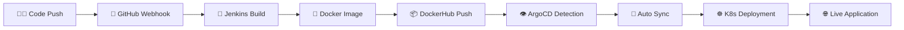

# 🚀 GitOps Projects Repository


**Comprehensive collection of GitOps implementations, CI/CD pipelines, and DevOps automation projects**

---

## 🎯 Interactive Architecture Overview

### 📊 **[Live GitOps Architecture Diagram](https://sohaib1khan.github.io/GitOps_Projects/)**

Experience our complete GitOps pipeline through an interactive, multi-tab visualization:

<div align="center">

**[🔗 View Interactive Diagram](https://sohaib1khan.github.io/GitOps_Projects/)**

*Click above to explore the full architecture with interactive components*

</div>

The diagram showcases:
- **🔧 Development & CI Layer**: GitHub, Jenkins, DockerHub integration
- **🚀 GitOps & CD Layer**: ArgoCD, Kubernetes API, Webhook automation  
- **☸️ Runtime & Storage Layer**: K3s cluster, MetalLB, Persistent storage
- **💾 Data Flow Management**: Complete data persistence strategy

---

## 🏗️ Repository Structure

```
GitOps_Projects/
├── 📊 docs/                          # Interactive architecture diagram
│   └── index.html                    # Live GitOps visualization
├── 🐍 AWS_Exam_App/                  # Flask application examples
├── 🔗 DashLink/                      # Dashboard applications  
├── 🚀 deploy_to_remote_machine/      # Remote deployment scripts
├── 🔧 jenkins/                       # Jenkins pipeline configurations
└── 📖 README.md                      # This comprehensive guide
```

---

## 🎓 Learning Objectives & Skills Demonstrated

### **DevOps Core Competencies**
- ✅ **GitOps Methodology** - Declarative infrastructure and application management
- ✅ **CI/CD Pipeline Design** - Automated build, test, and deployment workflows
- ✅ **Container Orchestration** - Kubernetes deployment and management
- ✅ **Infrastructure as Code** - Kubernetes manifests and configuration management
- ✅ **Monitoring & Observability** - Application health checks and logging

### **Technical Stack Proficiency**
- ✅ **Kubernetes/K3s** - Container orchestration on Proxmox infrastructure
- ✅ **Jenkins** - Continuous Integration and automated pipeline execution
- ✅ **ArgoCD** - GitOps continuous delivery and sync management
- ✅ **Docker** - Application containerization and image management
- ✅ **Python/Flask** - Backend application development and API design
- ✅ **MetalLB** - Load balancing for bare-metal Kubernetes clusters

---

## 🚀 Complete GitOps Workflow

### **Automated Development Pipeline**



### **Real-World Implementation**

1. **📝 Code Changes** → Developer pushes to GitHub repository
2. **🔔 Webhook Trigger** → GitHub automatically notifies Jenkins
3. **🔧 CI Pipeline** → Jenkins builds, tests, and containerizes application
4. **📦 Image Registry** → Automated push to DockerHub with versioning
5. **👁️ GitOps Detection** → ArgoCD monitors Git for infrastructure changes
6. **🔄 Automated Sync** → ArgoCD deploys changes to Kubernetes cluster
7. **🌐 Live Deployment** → Application accessible via MetalLB LoadBalancer

---

## 🛠️ Infrastructure & Environment

### **Homelab Architecture**
- **🖥️ Proxmox Virtualization** - Enterprise-grade hypervisor platform
- **☸️ K3s Kubernetes Cluster** - Lightweight, production-ready orchestration
- **🔧 Jenkins CI/CD Server** - Automated pipeline execution environment
- **🚀 ArgoCD GitOps Operator** - Declarative continuous delivery
- **⚖️ MetalLB Load Balancer** - External service exposure for bare-metal

### **Persistent Data Management**
- **💾 Host Path Storage** - Direct node storage mounting
- **🔄 Init Container Strategy** - Automated data initialization
- **📁 Volume Mount Configuration** - Persistent file system integration
- **🛡️ Data Protection** - Survives pod restarts and deployments

---

## 📚 Featured Projects

### **1. Flask GitOps Application**
**Tech Stack**: Python, Flask, Docker, Kubernetes, Jenkins, ArgoCD

Complete web application with:
- RESTful API endpoints with health checks
- Persistent data storage with JSON file management
- Automated CI/CD pipeline with GitHub integration
- GitOps deployment with ArgoCD synchronization
- Production-ready Kubernetes manifests

**Key Features**:
- 🔒 Secure container configuration with non-root user
- 📊 Health monitoring and readiness probes
- 🔄 Rolling update deployment strategy
- 💾 Data persistence across deployments
- 🌐 LoadBalancer service with MetalLB integration

### **2. AWS Exam Application**
**Purpose**: Cloud certification preparation platform
- Interactive study materials and progress tracking
- Containerized deployment with persistent user data
- CI/CD integration for continuous content updates

### **3. DashLink Dashboard**
**Purpose**: Centralized application and service management
- Service discovery and health monitoring
- Quick access portal for development tools
- Responsive design for mobile and desktop access

---

## 🔧 Quick Start Guide

### **Prerequisites**
- Kubernetes/K3s cluster running
- Jenkins with Docker and kubectl access
- ArgoCD installed and configured
- DockerHub account for image registry
- GitHub repository with webhook capabilities

### **Deployment Commands**

```bash
# Clone the repository
git clone https://github.com/sohaib1khan/GitOps_Projects.git
cd GitOps_Projects

# Deploy data persistence layer (one-time setup)
kubectl apply -f k8s/data-setup.yaml

# Deploy application via GitOps
kubectl apply -f k8s/deployment.yaml

# Verify deployment status
kubectl get pods,svc -n flask-gitops

# Access application
curl http://YOUR_LOAD_BALANCER_IP
```

### **Pipeline Configuration**

1. **Jenkins Setup**: Configure DockerHub and GitHub credentials
2. **ArgoCD Application**: Point to your repository's k8s/ directory
3. **GitHub Webhook**: Enable automatic build triggers
4. **Load Balancer**: Configure MetalLB IP range for service exposure

---

## 📈 Monitoring & Operations

### **Health Monitoring**
```bash
# Check application status
kubectl get pods -n flask-gitops

# View application logs
kubectl logs -f deployment/flask-app -n flask-gitops

# Monitor ArgoCD sync status
kubectl get applications -n argocd
```

### **Troubleshooting**
```bash
# Debug pod issues
kubectl describe pod -l app=flask-app -n flask-gitops

# Check persistent storage
ls -la /home/k8server/FlaskGitOpsData/

# Verify ArgoCD repository connection
argocd repo list
```

---

## 📖 Documentation & Resources

### **Architecture References**
- 📊 **[Interactive Architecture Diagram](https://sohaib1khan.github.io/GitOps_Projects/)** - Complete visual overview
- 📋 **[Setup Guide](docs/setup-guide.md)** - Step-by-step implementation
- 🔧 **[Configuration Examples](k8s/)** - Kubernetes manifest templates
- 🚀 **[Pipeline Templates](jenkins/)** - Jenkins CI/CD configurations

### **Best Practices Implemented**
- **🔒 Security**: Non-root containers, resource limits, secret management
- **📊 Observability**: Health checks, logging, monitoring integration
- **🔄 Reliability**: Rolling updates, replica management, data persistence
- **⚡ Performance**: Resource optimization, efficient image layering
- **🛡️ Resilience**: Auto-healing, backup strategies, disaster recovery

---

## 🎯 Professional Development

### **DevOps Journey**
This repository represents my transition from **RPA Support Engineer** to **DevOps practitioner**, showcasing:

- **🐍 Python Development**: Growing proficiency in application development
- **☸️ Kubernetes Expertise**: Container orchestration and cluster management  
- **🔄 CI/CD Mastery**: Automated pipeline design and implementation
- **🏗️ Infrastructure as Code**: Declarative infrastructure management
- **📊 Monitoring & Operations**: Production-ready deployment practices

### **Continuous Learning**
- Regular practice with new DevOps tools and methodologies
- Implementation of industry best practices and patterns
- Contribution to open-source DevOps community
- Hands-on experience with enterprise-grade infrastructure

---

## 🤝 Connect & Collaborate

### **Repository Highlights**
- ⭐ **2 Stars** - Community recognition
- 👀 **1 Watching** - Active monitoring
- 🍴 **0 Forks** - Open for collaboration

### **Get Involved**
- 🐛 **Issues**: Report bugs or suggest improvements
- 💡 **Discussions**: Share ideas and best practices
- 🔀 **Pull Requests**: Contribute enhancements
- ⭐ **Star**: Show support for the project

---

## 📧 Contact & Support

**Sohaib Khan** - RPA Support Engineer | DevOps Enthusiast

- 📧 **Email**: [Your email]
- 💼 **LinkedIn**: [Your LinkedIn profile]
- 🐙 **GitHub**: [@sohaib1khan](https://github.com/sohaib1khan)
- 📊 **Live Demo**: [GitOps Architecture](https://sohaib1khan.github.io/GitOps_Projects/)

---

<div align="center">

### **🚀 Transforming Infrastructure Through Code**


**[🔗 Explore the Interactive Architecture](https://sohaib1khan.github.io/GitOps_Projects/)**

</div>

---
